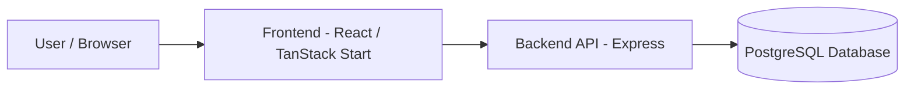
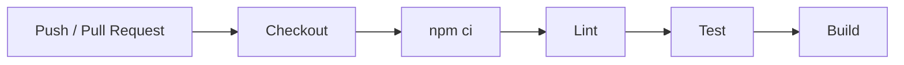
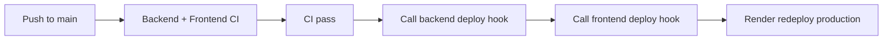

# DevOps Booking System

He thong quan ly lich booking duoc xay dung theo yeu cau do an DevOps: co frontend, backend API, PostgreSQL database, Docker, CI/CD, production deployment va quy trinh debug theo layer.

## 1. Tong Quan

Repository: `VanSyx/DevOps_BookingSystem`

Thanh phan chinh:

- Frontend: React, TanStack Start, TanStack Router, Vite, TypeScript.
- Backend API: Node.js, Express, PostgreSQL driver `pg`.
- Database: PostgreSQL 16.
- Container: Dockerfile rieng cho backend/frontend va `docker-compose.yml`.
- CI/CD: GitHub Actions, lint/test/build va Render deploy hooks.
- Production: Render Web Services + Render PostgreSQL.

Production URLs hien tai:

- Frontend: `https://booking-frontend-igsg.onrender.com`
- Backend API: `https://booking-backend-1g8f.onrender.com`
- Health check: `https://booking-backend-1g8f.onrender.com/api/health`

## 2. Kien Truc He Thong



Thu muc:

```text
DevOps_BookingSystem/
  backend/
  frontend/
  .github/workflows/ci.yml
  docker-compose.yml
  .env.example
  README.md
```

## 3. Chuc Nang Chinh

Ung dung quan ly booking co du lieu that trong database:

- Tao booking moi.
- Xem danh sach bookings.
- Cap nhat thong tin booking.
- Xoa booking.
- Doi trang thai booking.
- Huy booking.
- Xem thong ke dashboard.
- Xem danh sach customers tong hop tu bookings.

Trang thai booking:

```text
pending
confirmed
cancelled
completed
```

Quy tac trang thai:

- Booking moi bat buoc bat dau voi `pending`.
- `pending` co the chuyen sang `confirmed` hoac `cancelled`.
- `confirmed` co the chuyen sang `completed` hoac `cancelled`.
- `cancelled` la trang thai ket thuc, khong duoc chuyen sang trang thai khac.
- `completed` la trang thai ket thuc, khong duoc chuyen sang trang thai khac.
- Booking `cancelled` hoac `completed` khong duoc sua thong tin.

Chong dat trung:

- Khong cho dat trung cung `service + book_date + book_time` neu booking dang active.
- Active statuses gom `pending`, `confirmed`, `completed`.
- Booking `cancelled` khong giu slot, co the dat lai slot do.

## 4. Backend API

Backend chay trong thu muc `backend`.

Endpoint bat buoc:

```http
GET /api/health
```

Dung de:

- Kiem tra deploy.
- Kiem tra backend con song.
- Lam Render health check.
- Lam Docker health check.

Ket qua mau:

```json
{
  "ok": true,
  "timestamp": "2026-05-21T07:39:34.654Z"
}
```

Endpoints chinh:

```http
GET    /api/bookings
GET    /api/bookings/stats
GET    /api/bookings/customers
GET    /api/bookings/:id
POST   /api/bookings
PATCH  /api/bookings/:id
PATCH  /api/bookings/:id/status
PATCH  /api/bookings/:id/cancel
DELETE /api/bookings/:id
```

Loi nghiep vu quan trong:

- `400 Bad Request`: thieu field, sai email, sai date/time, status khong hop le.
- `404 Not Found`: booking khong ton tai.
- `409 Conflict`: dat trung slot hoac doi trang thai khong hop le.

## 5. Database

Database su dung PostgreSQL.

Bang chinh: `bookings`

Cot chinh:

- `id`
- `name`
- `phone`
- `email`
- `service`
- `book_date`
- `book_time`
- `status`
- `note`
- `created_at`
- `updated_at`

Backend co ham khoi tao/migrate schema trong:

```text
backend/src/database/schema.js
```

Schema migration co cac nhiem vu:

- Tao enum `booking_status`.
- Tao bang `bookings` neu chua co.
- Them cac cot con thieu neu database da ton tai tu truoc.
- Backfill du lieu mac dinh cho row cu.
- Tao unique index `uq_active_booking_slot` de chan dat trung active slot.

## 6. Environment

File mau:

```text
.env.example
backend/.env.example
```

Root `.env.example`:

```env
POSTGRES_DB=booking_db
POSTGRES_USER=booking_user
POSTGRES_PASSWORD=change_me_booking_password

BACKEND_PORT=3000
DB_SSL=false
CORS_ORIGIN=http://localhost
VITE_API_URL=http://localhost:3000/api
```

Nguyen tac:

- Khong commit `.env`.
- Khong hardcode database password production.
- Secrets production cau hinh tren Render va GitHub Secrets.
- `.env.example` chi la gia tri mau de chay local.

## 7. Chay Bang Docker

Yeu cau:

- Docker Desktop
- Docker Compose

Chay nhanh:

```bash
docker compose up -d --build
```

Lenh tren van chay duoc neu chua co `.env`, vi `docker-compose.yml` da co default values an toan cho local.

Neu muon dung file env rieng:

```bash
cp .env.example .env
docker compose --env-file .env up -d --build
```

Kiem tra containers:

```bash
docker compose ps
```

Ket qua mong doi:

```text
booking_frontend   Up
booking_backend    Up healthy
booking_postgres   Up healthy
```

Kiem tra API:

```bash
curl http://localhost:3000/api/health
curl http://localhost:3000/api/bookings
```

Mo frontend:

```text
http://localhost
```

Xem logs:

```bash
docker compose logs -f frontend
docker compose logs -f backend
docker compose logs -f postgres
```

Dung stack:

```bash
docker compose down
```

Dung stack va xoa volume database local:

```bash
docker compose down -v
```

## 8. Local Development

### Backend

Can PostgreSQL dang chay va `DATABASE_URL` hop le.

```bash
cd backend
npm ci
npm run dev
```

Backend scripts:

```bash
npm run lint
npm test
npm run build
```

### Frontend

```bash
cd frontend
npm ci
npm run dev
```

Frontend scripts:

```bash
npm run lint
npm run test
npm run build
```

Ghi chu: tren Windows co the gap loi lint do CRLF/LF neu line endings bi thay doi. Neu gap loi `Delete CR`, can normalize line endings truoc khi chay CI.

## 9. CI/CD

Workflow:

```text
.github/workflows/ci.yml
```

Trigger:

- Push vao `main`.
- Push vao `develop`.
- Pull request vao `main` hoac `develop`.

Quyen workflow:

```yaml
permissions:
  contents: read
```

### 9.1 CI Flow



Backend job:

```text
npm ci
npm run lint
npm test
npm run build
```

Frontend job:

```text
npm ci
npm run lint
npm test
npm run build
```

### 9.2 CD Flow

CD duoc thuc hien bang Render Deploy Hooks.



Deploy job chi chay khi:

```text
event = push
branch = main
backend job pass
frontend job pass
```

Can khai bao GitHub repository secrets:

```text
RENDER_BACKEND_DEPLOY_HOOK_URL
RENDER_FRONTEND_DEPLOY_HOOK_URL
```

Neu thieu secrets, deploy job se fail voi message ro rang:

```text
Missing GitHub secret RENDER_BACKEND_DEPLOY_HOOK_URL
Missing GitHub secret RENDER_FRONTEND_DEPLOY_HOOK_URL
```

## 10. Deploy Production Tren Render

Thu tu deploy dung:

```text
PostgreSQL -> Backend -> Frontend -> Update CORS -> Test full flow
```

### 10.1 PostgreSQL

Tao Render PostgreSQL truoc.

Lay `Internal Database URL` de cau hinh backend:

```text
DATABASE_URL=<Render PostgreSQL Internal Database URL>
```

### 10.2 Backend Service

Cau hinh Render backend:

```text
Service type: Web Service
Runtime: Docker
Root Directory: backend
Health Check Path: /api/health
```

Environment variables:

```env
NODE_ENV=production
PORT=3000
DATABASE_URL=<Render PostgreSQL Internal Database URL>
DB_SSL=false
CORS_ORIGIN=https://booking-frontend-igsg.onrender.com
```

Kiem tra:

```text
https://booking-backend-1g8f.onrender.com/api/health
```

### 10.3 Frontend Service

Cau hinh Render frontend:

```text
Service type: Web Service
Runtime: Docker
Root Directory: frontend
```

Environment/build variable:

```env
VITE_API_URL=https://booking-backend-1g8f.onrender.com/api
```

Kiem tra:

```text
https://booking-frontend-igsg.onrender.com
```

Frontend co fallback production trong `frontend/src/lib/api.ts` cho domain Render hien tai. Tuy nhien van nen set `VITE_API_URL` dung tren Render, vi day la cach cau hinh ro rang hon.

## 11. Debug Theo Layer

### L4 - Frontend

Dung:

- Browser DevTools Console
- Browser DevTools Network
- Render frontend logs

Loi thuong gap:

- `Could not connect to backend`
- Sai `VITE_API_URL`
- Vite blocked host
- CORS error

### L3 - Backend

Dung:

```bash
docker compose logs -f backend
```

Hoac Render backend logs.

Loi thuong gap:

- API 500.
- Sai `DATABASE_URL`.
- Migration schema loi.
- Status transition khong hop le.

### L2 - Database

Dung:

```bash
docker compose logs -f postgres
```

Loi thuong gap:

- Sai user/password/db.
- Database chua healthy.
- Bang cu thieu cot.
- Unique index bao trung slot.

### L1 - Infrastructure

Dung:

```bash
docker compose ps
docker compose config
docker compose logs
```

Loi thuong gap:

- Docker Desktop chua chay.
- Container restart loop.
- Port bi trung.
- Env trong compose bi render thanh rong.

## 12. Incidents Da Gap Va Cach Fix

### Incident 1: Docker Compose env rong lam backend khong ket noi PostgreSQL

Log:

```text
FATAL: role "-d" does not exist
FATAL: no PostgreSQL user name specified in startup packet
```

Layer:

```text
L1 Infrastructure + L2 Database + L3 Backend
```

Nguyen nhan:

- Chua co file `.env`.
- Compose render `POSTGRES_USER`, `POSTGRES_DB`, `POSTGRES_PASSWORD` thanh rong.
- `DATABASE_URL` thanh `postgres://:@postgres:5432/`.

Fix:

- Them default values trong `docker-compose.yml`.
- Dung `$${POSTGRES_USER}` va `$${POSTGRES_DB}` trong healthcheck de bien duoc resolve ben trong container.

Ket qua:

- `booking_postgres` healthy.
- `booking_backend` healthy.
- `/api/health` tra `ok: true`.

### Incident 2: Render backend loi `column "status" does not exist`

Log:

```text
Failed to start server error: column "status" does not exist
```

Layer:

```text
L2 Database + L3 Backend
```

Nguyen nhan:

- Database Render da co bang `bookings` cu.
- Bang cu thieu cot `status`.
- Backend tao unique index co dieu kien `WHERE status IN (...)`.

Fix:

- Sua `backend/src/database/schema.js`.
- Them migration bo sung cot con thieu.
- Backfill du lieu mac dinh.
- Sau do tao unique index.

### Incident 3: Frontend Docker restart loop do thieu runtime dependencies

Log:

```text
Cannot find package '@lovable.dev/vite-tanstack-config'
```

Layer:

```text
L4 Frontend runtime + L1 Infrastructure
```

Nguyen nhan:

- Container production chay `vite preview`.
- Runtime image ban dau khong co dependency/config can cho Vite/TanStack.

Fix:

- Sua `frontend/Dockerfile` multi-stage.
- Copy `node_modules`, `dist`, `src`, `tsconfig.json`, `vite.config.ts`, `wrangler.jsonc`.
- Tao `dist/server/server.js` tu `dist/server/index.js`.

### Incident 4: Render frontend bi Vite blocked host

Log:

```text
Blocked request. This host is not allowed.
```

Layer:

```text
L4 Frontend config
```

Nguyen nhan:

- Vite preview chua allow host Render.

Fix:

- Them `preview.allowedHosts` trong `frontend/vite.config.ts`.

### Incident 5: Frontend load UI nhung khong connect backend

Log/UI:

```text
Could not connect to backend
```

Layer:

```text
L4 Frontend + L3 Backend config
```

Nguyen nhan:

- `VITE_API_URL` khong duoc inject dung luc build.
- Frontend fallback ve `/api` tren frontend domain.

Fix:

- Set `VITE_API_URL` tren Render frontend.
- Them fallback production trong `frontend/src/lib/api.ts`.

## 13. Checklist Cham Diem

### System

- Frontend load duoc: co.
- Backend `/api/health` OK: co.
- API tra du lieu: co.
- Du lieu that trong PostgreSQL: co.
- Co status thay doi: co.
- Co them/sua/xoa: co.

Can kiem tra truoc demo:

- Browser console khong co loi.
- Network tab goi dung backend URL.

### Docker

- Co `backend/Dockerfile`: co.
- Co `frontend/Dockerfile`: co.
- Co `docker-compose.yml`: co.
- `docker compose up -d --build` chay du 3 service: co.
- Container running/healthy: can chup man hinh `docker compose ps`.
- Co log: dung `docker compose logs`.
- Multi-stage: frontend Dockerfile co multi-stage.

### CI/CD

- Co GitHub Actions: co.
- Co backend lint/test/build: co.
- Co frontend lint/test/build: co.
- Co CD deploy hook Render: co.
- Deploy chi chay sau khi CI pass: co.
- Khong hardcode deploy secret: co, dung GitHub Secrets.

### Deploy

- Backend Render: co.
- Frontend Render: co.
- PostgreSQL Render: co.
- URL public: co.
- Co the redeploy bang Render deploy hooks: co.

### Environment

- Co `.env.example`: co.
- Khong commit `.env`: co.
- Docker Compose co default env local: co.
- Production secrets nam tren Render/GitHub Secrets: co.

### Debug

- Co incident that: co.
- Debug dung layer: co.
- Fix thanh cong: co.

### Documentation

- Co architecture diagram: co.
- Co CI/CD flow: co.
- Co huong dan Docker/local/deploy/debug: co.

## 14. Huong Dan Demo

Thu tu demo khuyen nghi:

1. Mo frontend production:

```text
https://booking-frontend-igsg.onrender.com
```

2. Mo backend health:

```text
https://booking-backend-1g8f.onrender.com/api/health
```

3. Tao booking moi tren UI.

4. Doi status:

```text
pending -> confirmed -> completed
```

5. Thu cancel booking.

6. Thu tao booking trung slot de nhan loi `409`.

7. Mo Render logs backend/frontend.

8. Chay local Docker:

```bash
docker compose up -d --build
docker compose ps
docker compose logs -f backend
```

9. Mo GitHub Actions va chi ra:

- Backend CI.
- Frontend CI.
- Deploy to Render job.

10. Chi ra GitHub Secrets:

```text
RENDER_BACKEND_DEPLOY_HOOK_URL
RENDER_FRONTEND_DEPLOY_HOOK_URL
```

## 15. Role De Xuat Khi Trinh Bay

Neu can phan vai trong bao cao:

- Backend/API: thiet ke Express API, validation status, PostgreSQL schema.
- Frontend: tich hop dashboard UI, goi API, hien thi booking/customer/stats.
- DevOps: Dockerfile, Docker Compose, GitHub Actions, Render deploy hooks, environment.
- QA/Debug: test health/API, debug Docker/Render/CORS/database incidents.

## 16. Ket Luan

Du an dap ung cac yeu cau chinh:

- Co frontend, backend API va database.
- Co endpoint `GET /api/health`.
- Co du lieu that va co thay doi trang thai.
- Co Dockerfile va Docker Compose.
- Co CI/CD voi GitHub Actions va Render deploy hooks.
- Co deploy production tren Render.
- Co debug incidents that va cach fix theo layer.

Truoc khi nop, can xac nhan lai 3 muc:

1. GitHub Actions run moi nhat pass.
2. Render frontend khong con loi console/network.
3. `docker compose ps` hien backend/postgres healthy va frontend up.
