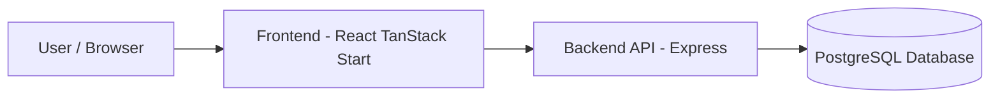
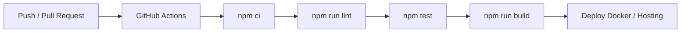

# DevOps_BookingSystem

Booking system theo yeu cau DevOps: co Frontend, Backend API, Database, Docker Compose, CI pipeline va endpoint health check de kiem tra deploy.

## 1. Kien truc



Thanh phan:
- Frontend: `frontend` - React/TanStack Start.
- Backend API: `backend` - Express.
- Database: PostgreSQL 16.
- Docker: `backend/Dockerfile`, `frontend/Dockerfile`, `docker-compose.yml`.
- CI/CD: `.github/workflows/ci.yml`.

API bat buoc:
- `GET /api/health` - dung de kiem tra backend/deploy.

API chinh:
- `GET /api/bookings`
- `GET /api/bookings/stats`
- `GET /api/bookings/customers`
- `POST /api/bookings`
- `PATCH /api/bookings/:id`
- `PATCH /api/bookings/:id/status`
- `PATCH /api/bookings/:id/cancel`
- `DELETE /api/bookings/:id`

## 2. Du lieu va logic

Ung dung co du lieu that trong PostgreSQL:
- Them/sua/xoa bookings.
- Trang thai thay doi: `pending`, `confirmed`, `cancelled`, `completed`.
- Thong ke dashboard theo tong booking, booking hom nay va booking theo status.
- Danh sach customers tong hop tu booking.

Validation booking:
- Booking moi luon bat dau voi `pending`.
- Luong status hop le:
  - `pending -> confirmed`
  - `pending -> cancelled`
  - `confirmed -> completed`
  - `confirmed -> cancelled`
- `cancelled` va `completed` la trang thai ket thuc, khong duoc sua hoac doi sang trang thai khac.
- Khong cho dat trung cung `service + date + time` neu booking dang `pending`, `confirmed` hoac `completed`.
- Booking `cancelled` se giai phong slot de co the dat lai.

## 3. Chay bang Docker

Yeu cau: Docker Desktop va Docker Compose.

```bash
cp .env.example .env
docker compose up -d --build
docker compose ps
```

Kiem tra:
- Frontend: `http://localhost`
- Health API: `http://localhost:3000/api/health`
- Bookings API: `http://localhost:3000/api/bookings`

Service map:
- Frontend: host port `80`.
- Backend: host port `3000`.
- PostgreSQL: host port `5432`.

Log/debug:
```bash
docker compose logs -f frontend
docker compose logs -f backend
docker compose logs -f postgres
docker compose config
```

Neu gap thong bao container da chay san, dung:
```bash
docker compose ps
docker compose restart backend frontend
```

## 4. Local dev

Backend:
```bash
cd backend
npm ci
npm run dev
```

Frontend:
```bash
cd frontend
npm ci
npm run dev
```

Bien moi truong quan trong:
- `DATABASE_URL`: connection string PostgreSQL cho backend.
- `DB_SSL`: dat `true` khi database cloud yeu cau SSL, local Docker de `false`.
- `CORS_ORIGIN`: domain frontend duoc phep goi API.
- `VITE_API_URL`: base URL API cho frontend.

## 5. CI/CD flow



Workflow: `.github/workflows/ci.yml`

Trigger:
- `push` vao `main`, `develop`, `feature/**`.
- `pull_request` vao `main`, `develop`.

Jobs:
- Backend: install, lint, test, build check.
- Frontend: install, lint, test, build.

Pipeline se fail neu co step loi.

## 6. Deploy goi y

VPS/Docker:
```bash
git clone https://github.com/VanSyx/DevOps_BookingSystem.git
cd DevOps_BookingSystem
cp .env.example .env
docker compose up -d --build
curl http://localhost:3000/api/health
```

Render/Railway/VPS tach service:
- Tao PostgreSQL database.
- Backend env:
  - `NODE_ENV=production`
  - `PORT=3000`
  - `DATABASE_URL=<postgres connection string>`
  - `DB_SSL=true` neu database cloud yeu cau SSL
  - `CORS_ORIGIN=<frontend public url>`
- Frontend env/build arg:
  - `VITE_API_URL=<backend public url>/api`

Sau khi deploy, kiem tra:
- Public frontend URL load duoc.
- Public backend `GET /api/health` tra `{ "ok": true }`.
- Tao/sua/xoa booking tren UI va kiem tra DB co thay doi.

## 7. Debug theo layer

- L4 Frontend: Browser DevTools Console/Network, kiem tra `VITE_API_URL`.
- L3 Backend: `docker compose logs -f backend`, kiem tra status code va validation error.
- L2 Database: `docker compose logs -f postgres`, kiem tra connection string va schema.
- L1 Infrastructure: `docker compose ps`, `docker compose config`, port mapping va healthcheck.

## 8. Incident samples

Incident 1: API 500 khi backend khong ket noi DB
- Layer: L3/L2.
- Log: backend bao loi ket noi PostgreSQL hoac schema init fail.
- Nguyen nhan: sai `DATABASE_URL`, DB chua healthy hoac container postgres chua chay.
- Fix: kiem tra `.env`, `docker compose ps`, `docker compose logs -f postgres`, restart stack.
- Phong tranh: dung `.env.example`, `depends_on` healthcheck va `/api/health`.

Incident 2: Frontend bi CORS/network error
- Layer: L4/L3.
- Log: browser console bao CORS hoac fetch failed.
- Nguyen nhan: `CORS_ORIGIN` hoac `VITE_API_URL` sai URL deploy.
- Fix: cap nhat env frontend/backend, rebuild frontend.
- Phong tranh: tach env dev/prod, kiem tra Network tab truoc demo.

Incident 3: Dat trung booking slot
- Layer: L3/L2.
- Log: API tra `409 This booking slot is already taken`.
- Nguyen nhan: ton tai booking active cung service, date, time.
- Fix: doi gio/dich vu hoac cancel booking cu.
- Phong tranh: validate backend va unique index `uq_active_booking_slot` tren database.

## 9. Checklist nop bai

- Frontend load duoc.
- Backend API hoat dong.
- Database co du lieu that, co them/sua/xoa.
- `GET /api/health` hoat dong.
- Booking co status va lich su thay doi qua `updated_at`.
- Docker Compose chay du `frontend`, `backend`, `postgres`.
- CI/CD GitHub Actions co install/lint/test/build.
- Khong hardcode secret; su dung `.env.example`.
- Co huong dan debug/log theo layer.
- Co it nhat 3 incident mau de dua vao bao cao.
